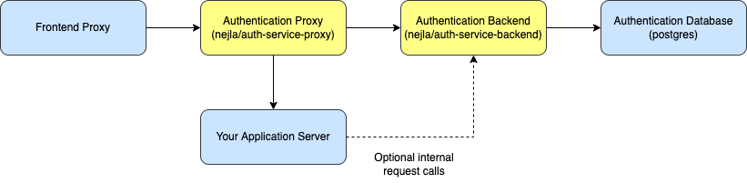

# auth-service

An authentication micro-service for web applications or web APIs.

## Overview

auth-service offers protection of one or more instances of web applications/APIs
along with the following features:

- Protection of one or more instances of web applications or web APIs
- Local accounts (in the form of user names and passwords stored in a database)
- Account roles
- Password resets via e-mail
- External account creation
- SMS-based two-factor authentication for local accounts (via Twilio)
- Single sign-on via SAML

All features in the list above are opt-in.

## Container Structure

auth-service consists of an NGINX-based proxy (“Authentication Proxy”) and a
service for authenticating requests (“Authentication Backend”). auth-service
stores its state in a PostgreSQL database (“Authentication Database”).

In order to use auth-service to protect your web application or web API (“Your
Application Server”), you will need to configure an outer proxy (“Frontend
Proxy”) that is exposed externally (e.g. the Internet). An example using Docker
Compose and NGINX is provided.



auth-service provides Docker images for the yellow blocks (“Authentication
Proxy” and “Authentication Backend”). The official postgres image can be used
for auth-service's database (“Authentication Database”).

## Get started using Docker Compose and NGINX

Let's say we have a web API that we want to protect using auth-service.

`backend/index.js`:

```js
const http = require('http')

const app = http.createServer((_request, response) => {
  response.setHeader('Content-Type', 'application/json')
  response.write(JSON.stringify({ message: 'Hello World!' }))
  response.end()
})

app.listen({ port: 80 }, () => {
  console.log('The backend is running!')
})
```

`backend/Dockerfile`:

```Dockerfile
FROM node
EXPOSE 3000
CMD ["node", "index.js"]
WORKDIR /app
COPY index.js .
```

We can then use Docker Compose to protect this backend, using a
`docker-compose.yml` file such as this one:

```yaml
networks:
  auth-service:
  proxy:

services:
  auth-service-backend:
    depends_on:
      auth-service-database:
        condition: service_healthy
    environment:
      - DB_HOST=auth-service-database
    image: nejla/auth-service-backend
    networks:
      - auth-service
      - proxy
    restart: unless-stopped
  auth-service-database:
    environment:
      - POSTGRES_HOST_AUTH_METHOD=trust
    healthcheck:
      interval: 1s
      test: 'pg_isready -U postgres'
    image: postgres
    networks:
      - auth-service
    restart: unless-stopped
    volumes:
      - ./database:/var/lib/postgresql/data
  auth-service-proxy:
    depends_on:
      auth-service-backend:
        condition: service_healthy
    healthcheck:
      interval: 1s
      test: service nginx status || exit 1
    image: nejla/auth-service-proxy
    links:
      - auth-service-backend:auth-service
      - backend:0d6a2251-e82c-47a9-9895-dbc22c7b6852
    networks:
      - proxy
    restart: unless-stopped
  backend:
    build: backend
    healthcheck:
      interval: 1s
      test: 'curl -f http://localhost/'
    networks:
      - proxy
    restart: unless-stopped
  proxy:
    depends_on:
      auth-service-proxy:
        condition: service_healthy
      backend:
        condition: service_healthy
    healthcheck:
      interval: 1s
      test: service nginx status || exit 1
    image: nginx
    networks:
      - proxy
    ports:
      - '8080:80'
    restart: unless-stopped
    volumes:
      - ./nginx.conf:/etc/nginx/nginx.conf:ro
```

As mentioned above, auth-service can protect of one or more instances of web
applications or web APIs. Each instance must have a UUID that uniquely
identifies it. `0d6a2251-e82c-47a9-9895-dbc22c7b685` is used above, but that's
just an example.

`nginx.conf` contains the “Frontend Proxy” configuration. In a case like this,
it could look like this:

```
events {}

http {
  server {
    listen 80;

    location /api {
      proxy_set_header X-Forwarded-For $proxy_add_x_forwarded_for;
      proxy_set_header X-Instance 0d6a2251-e82c-47a9-9895-dbc22c7b6852;
      proxy_set_header X-Original-URI $request_uri;
      proxy_set_header X-Real-IP $remote_addr;

      proxy_pass http://auth-service-proxy/;
    }
  }
}
```

The `X-Instance` header must be set to the UUID value for the instance. Note
that the same UUID value is present in the Docker Compose configuration &ndash;
auth-service-proxy uses this UUID value as the hostname to forward requests to.

Start the Docker Compose services:

```
$ docker-compose up -d
```

Check that the Docker Compose services are up and running:

```
$ docker-compose ps
NAME                                           COMMAND                  SERVICE                 STATUS              PORTS
auth-service-example-auth-service-backend-1    "auth-service run"       auth-service-backend    running (healthy)   80/tcp
auth-service-example-auth-service-database-1   "docker-entrypoint.s…"   auth-service-database   running (healthy)   5432/tcp
auth-service-example-auth-service-proxy-1      "/docker-entrypoint.…"   auth-service-proxy      running (healthy)   80/tcp, 443/tcp
auth-service-example-backend-1                 "docker-entrypoint.s…"   backend                 running (healthy)   3000/tcp
auth-service-example-proxy-1                   "/docker-entrypoint.…"   proxy                   running (healthy)   0.0.0.0:8080->80/tcp, :::8080->80/tcp
```

auth-service is now protecting the backend service. Accessing the API without
authenticating won't work:

```
$ curl http://localhost:8080/api
<html>
<head><title>403 Forbidden</title></head>
<body>
<center><h1>403 Forbidden</h1></center>
<hr><center>nginx/1.23.2</center>
</body>
</html>
```

In order to try authenticating, add a user like so:

```
$ docker-compose exec auth-service-backend auth-service \
    adduser user@example.com secret "Example User"
```

Make auth-service aware of the instance (backend) using the same UUID again:

```
$ docker-compose exec auth-service-backend auth-service \
    newinstance example 0d6a2251-e82c-47a9-9895-dbc22c7b6852
```

Give the example user access to the instance:

```
$ docker-compose exec auth-service-backend auth-service \
    addinstance user@example.com 0d6a2251-e82c-47a9-9895-dbc22c7b6852
```

Sign in the user to get an access token:

```
$ curl \
    -d '{ "password": "secret", "user": "user@example.com" }' \
    -H "Content-Type: application/json" \
    -w "\n" \
    http://localhost:8080/api/login
{"token":"YQhZ7OVedqVAM2IXdsonua","instances":[{"name":"example","id":"0d6a2251-e82c-47a9-9895-dbc22c7b6852"}]}
```

We can now access the backend using the token like so:

```
$ curl -H "X-Token: YQhZ7OVedqVAM2IXdsonua" -w "\n" http://localhost:8080/api
{"message":"Hello World!"}
```

Instead of using the `X-Token header`, we can also use a cookie (with the same
token value). Cookies can be useful for signing in using web frontends.

```
$ curl \
    -H "Cookie: token=YQhZ7OVedqVAM2IXdsonua" \
    -w "\n" \
    http://localhost:8080/api
{"message":"Hello World!"}
```

User can log out (deactivate the current token) by making a `POST` request to
`/api/logout`.

A user can deactivate all tokens belonging to the account **except** the current
token by making a `POST` request to `/api/disable-sessions`.

Finally, users can get information about their accounts (including ID, name,
e-mail, phone number, instances and roles) by making `GET` requests to
`/api/user-info`.

We are now up and running with auth-service! 🚀

## Configure a static login page with NGINX

auth-service can be used with Single Page Application (SPA) frameworks and
libraries like React and Vue.js. In that scenario, a static login page is not
necessary. The UI can itself manage requests to `/api/login` and the resulting
authentication sessions.

However, for web applications that are not SPAs, or in order to get started more
quickly, auth-service can offer a static login page.

In order to use a static login page, put the following configuration into your
frontend proxy.

```
location /auth/ {
  index index.html;
  proxy_pass http://auth-service-proxy/authentication/;
  proxy_pass_request_body off;
  proxy_redirect http://auth-service-proxy/ /;
  proxy_set_header Content-Length "";
  proxy_set_header X-Forwarded-for $proxy_add_x_forwarded_for;
  proxy_set_header X-Original-URI $request_uri;
  proxy_set_header X-Real-IP $remote_addr;
}
```

Also, if you want unauthenticated requests to /index.html to be translated into
the authentication page of this component, add the following:

```
location /index.html {
  auth_request /api/auth;
  error_page 403 =303 /auth.html;
}
```

## Options for auth-service-backend

The auth-service-backend service can be configured by setting environment
variables, e.g. by adding `-E "option=value"` to `docker` calls or by setting
them under `environment` in your `docker-compose.yml` files.

### General Options

| Option                 | Required | Type    | Default | Description                                                                                                                                                                                                                   |
|------------------------|----------|---------|---------|-------------------------------------------------------------------------------------------------------------------------------------------------------------------------------------------------------------------------------|
| `TOKEN_TIMEOUT`        | No       | Integer | Unset   | Time in seconds before a given token expire after the token was created. Only affects newly created tokens. Tokens don't expire if unset, unless the tokens expire because of `TOKEN_UNUSED_TIMEOUT` (see below).             |
| `TOKEN_UNUSED_TIMEOUT` | No       | Integer | Unset   | Time in seconds before a given token expire after the token was last used. Making a request that causes a token to be checked counts as using the token. Affects all tokens. If unset, tokens don't expire from being unused. |

### Password Reset E-mails Options

auth-service can offer password reset e-mails containing a password reset link. By default, the e-mail functionality is disabled.

If the `EMAIL_FROM` option is set, the e-mail functionality is enabled and a number of other options become required. If the `EMAIL_FROM` option is unset, the e-mail functionality is disabled and all other e-mail-related options are ignored.

| Option                       | Required               | Type                        | Default              | Description                                                                                                                                         |
|------------------------------|------------------------|-----------------------------|----------------------|-----------------------------------------------------------------------------------------------------------------------------------------------------|
| `EMAIL_FROM`                 | No                     | String                      | Unset                | E-mail address to send e-mail from.                                                                                                                 |
| `EMAIL_PASSWORD`             | If `EMAIL_FROM` is set | String                      | Unset                | SMTP password to use for sending e-mail.                                                                                                            |
| `EMAIL_SMTP`                 | If `EMAIL_FROM` is set | String                      | Unset                | SMTP server to use for sending e-mail.                                                                                                              |
| `EMAIL_USER`                 | If `EMAIL_FROM` is set | String                      | Unset                | SMTP user name to use for sending e-mail.                                                                                                           |
| `SITE_NAME`                  | If `EMAIL_FROM` is set | String                      | Unset                | Displayed name of your application used in password reset e-mails. Can for example be the name of your application or your application's hostname.  |
| `EMAIL_AUTH`                 | No                     | Boolean (`true` or `false`) | `true`               | Whether to authenticate to the SMTP server.                                                                                                         |
| `EMAIL_FROM_NAME`            | No                     | String                      | Unset                | Human-visible name of the sender.                                                                                                                   |
| `EMAIL_LINK_TEMPLATE`        | Yes                    | String                      | Unset                | Template to generate links from password reset tokens (e.g. `https://my-app.example.com/reset-password?token=%s`). `%s` is replaced with the token. |
| `EMAIL_PORT`                 | No                     | Integer                     | `25`                 | SMTP server port to use for sending e-mail.                                                                                                         |
| `EMAIL_TLS`                  | No                     | Boolean (`true` or `false`) | `true`               | Whether to use TLS to connect to the SMTP server.                                                                                                   |
| `RESET_LINK_EXPIRATION_TIME` | No                     | Integer                     | `24`                 | Time in hours before password reset links expire.                                                                                                   |
| `SENDMAIL_PROGRAM`           | No                     | String                      | `/usr/sbin/sendmail` | Path to the `sendmail` executable to use, followed by the arguments, separated by spaces.                                                           |

A password reset e-mail request will always succeed, even if the e-mail address does not belong to an auth-service user, in order to prevent oracle attacks.

By default, the following two e-mail templates are used:

- [`service/src/html/password-reset-email-template.html.mustache`](service/src/html/password-reset-email-template.html.mustache)
- [`service/src/html/password-reset-unknown-email-template.html.mustache`](service/src/html/password-reset-unknown-email-template.html.mustache)

However, you can provide your own by voluming in Mustache files into the `/app` directory in the auth-server-backend container. Using Docker Compose that can be done like so:

```yaml
    volumes:
      - ./password-reset-email-template.html.mustache:/app/password-reset-email-template.html.mustache:ro
      - ./password-reset-unknown-email-template.html.mustache:/app/password-reset-unknown-email-template.html.mustache.mustache:ro
```

There are three endpoints that can be used for password resets:

- `POST` requests to `/api/request-password-reset` will request a password reset e-mails to be sent. The body should contain an `email` property, like so: `{ "email": "example@example.com" }`.
- `GET` requests to `/api/reset-password-info` with a `token` query parameter (like `/api/reset-password-info?token=...`) can be used to check the validity of tokens (whether or not they exist, have not expired and have not been used).
- `POST` requests to `/api/reset-password` will use a valid token to set a new password. The body should contain `token` and `newPassword` properties, like so: `{ "newPassword": "...", "token": "..." }`.

### Two-Factor Authentication Options

auth-service can use Twilio, a mobile messaging service, for two-factor authentication in the form of one-time SMS codes. By default, the two-factor authentication functionality is disabled.

If the `TFA_REQUIRED` option is set to `true`, the two-factor functionality is enabled and the “TWILIO” options become required. If `TFA_REQUIRED` is unset, or set to `false`, the two-factor functionality is disabled.

| Option           | Required                 | Type                        | Default | Description                                                                                |
|------------------|--------------------------|-----------------------------|---------|--------------------------------------------------------------------------------------------|
| `TFA_REQUIRED`   | No                       | Boolean (`true` or `false`) | `false` | Whether two-factor authentication is required for all users in order to create new tokens. |
| `TWILIO_ACCOUNT` | If `TFA_REQUIRED` is set | String                      | Unset   | Twilio account to use when sending SMS messages.                                           |
| `TWILIO_TOKEN`   | If `TFA_REQUIRED` is set | String                      | Unset   | Twilio authentication token to use when sending SMS messages.                              |
| `TWILIO_SOURCE`  | If `TFA_REQUIRED` is set | String                      | Unset   | Twilio phone number to send messages from.                                                 |
| `OTP_LENGTH`     | No                       | Integer                     | 4       | Number of characters to use in one time passwords.                                         |
| `OTP_TIMEOUT`    | No                       | Integer                     | 300     | Time in seconds before one time passwords expire.                                          |

When two-factor authentication is used, users sign in using `POST` requests to `/api/login`, just like when two-factor authentication is not used.

The difference is that the first `POST` request to `/api/login` will (if the credentials are correct) respond with `499 Client Closed Request`.

The user then has to make **another** `POST` request to `/api/login`, this time with a body containing an `otp` property, in order to complete the login flow:

```json
{
  "otp":"..."
  "password": "...",
  "user": "...",
}
```

### Account Creation by Unathenticated Users

If the `ACCOUNT_CREATION` option is set to `true`, auth-service will allow for
accounts to be created using `POST` requests to `/api/create-account`.

| Option             | Required | Type                        | Default | Description                                                                                                                                                                              |
|--------------------|----------|-----------------------------|---------|------------------------------------------------------------------------------------------------------------------------------------------------------------------------------------------|
| `ACCOUNT_CREATION` | No       | Boolean (`true` or `false`) | `false` | Whether new accounts can be created using the auth-service web API.                                                                                                                      |
| `DEFAULT_INSTACE`  | No       | UUID                        | Unset   | Default instance ID to grant new accounts created using the auth-service web API access to. If the `X-Instance` header is set by the proxy, the header value will overrides this option. |

The request body should look like this:

```json
{
  "email": "...",
  "name": "...",
  "password": "...",
  "phone": "+..."
}
```

`email`, `name` and `password` are required. `phone` is optional.

### Signed Headers

For an extra layer of security, auth-service can be configured to provide a
signed header that your application server can use to verify that the incoming
request has indeed passed through auth-service. This could be useful in a
situation where the proxy server become compromised, or if some other container
manages to reach the container running your application server.

| Option                            | Required | Type   | Default                                   | Description                                                              |
|-----------------------------------|----------|--------|-------------------------------------------|--------------------------------------------------------------------------|
| `SIGNED_HEADERS_PRIVATE_KEY_PATH` | No       | String | `/run/secrets/header_signing_private_key` | Path to the Base64-DER-encoded Ed25519 private key to sign headers with. |

An Ed25519 key pair is used to sign and verify headers.

Instructions for generating the key pair follows.

Start by using `openssl` to generate the private key, and encoding it with
`base64`:

```
$ openssl genpkey -algorithm ed25519 -outform der | base64 > ed25519.priv.der
```

Make sure to set the right permissions on the private key:

```
$ chmod 0600 ed25519.priv.der
```

The public key can then be created like this:

```
$ base64 -d ed25519.priv.der \
    | openssl pkey -inform der -pubout -outform der \
    | base64 > ed25519.pub.der
```

When starting the auth-service container, we need to mount the private key to
`/run/secrets/header_signing_private_key` (or set
`SIGNED_HEADERS_PRIVATE_KEY_PATH` to the path where we put it). The key has to
be passed as a file and not an environment variable to prevent it from leaking.

The public key does not have to be secured and can be passed to the backend as
an environment variable.

## Configuring the auth-service-proxy container

The auth-service-proxy service can be configured in the same way as the
auth-service-backend service can, that is with environment variables.

Only one option is supported.

| Option            | Required | Type                        | Default | Description                                                                           |
|-------------------|----------|-----------------------------|---------|---------------------------------------------------------------------------------------|
| `SESSION_COOKIES` | No       | Boolean (`true` or `false`) | `false` | Whether or not cookies should be session cookies (as opposed to “permanent” cookies). |

Cookies set when calls to `/api/login` are made are “permanent” by default. “Permanent” cookies expires `Fri, 01-Jan-2038 00:00:01 GMT`.

## Managing users

### Creating new users

Like demonstrated above, users can be added by running the `adduser` command in
the `auth-service-backend` container:

```
$ docker-compose exec auth-service-backend auth-service \
    adduser user@example.com secret "Example User"
```

Additionally, users with the `admin` role can create new users via a `POST`
request to `/api/users` with a request body like the following:

```json
{
  "email": "...",
  "instances": ["de872e04-290a-40fc-a09b-855e078f94c9"],
  "name": "...",
  "password": "...",
  "phone": "+...",
  "roles": ["some-role"]
  "uuid": "b7bf312a-b589-429d-987c-8ac61c2b6eb4",
}
```

`uuid` and `phone` are optional. `uuid` will be filled in automatically if
unset.

Response:

```json
{
  "user": "b7bf312a-b589-429d-987c-8ac61c2b6eb4",
  "roles": ["some-role"]
}
```

### Changing user passwords

Login passwords can be changed via a `POST` request to `/api/change-password`
with a request body like the following:

```json
{
  "oldPasword": "...",
  "newPassword": "..."
}
```

Additionally, passwords can be changed by running the `chpasswd` command in
the `auth-service-backend` container:

```
$ docker-compose exec auth-service-backend auth-service \
    chpass user@example.com some-password
```

Using the above command, “some-password” would become the new password.

### Setting user roles

Users can have roles set. The roles will be passed to the backend container in
the `X-Roles` header.

You can modify a user's roles by using the `addrole` and `removerole` commands:

```
$ docker-compose exec auth-service-backend auth-service \
    addrole user@example.com some-role
```

```
$ docker-compose exec auth-service-backend auth-service \
    rmrole user@example.com some-role
```

Using the above commands, the user was first added to, and then removed from,
the “some-role” role.

## SAML 2.0

auth-service supports single sign-on via SAML 2.0. **SP-initiated** and
**IdP-initiated** login flows are supported.

**SP-initiated** login flows are supported via **redirect request bindings** (to
`/api/sso/login`) and **POST response bindings** (to `/api/sso/assert`).

**IdP-initiated** login flows are supported via **POST response bindings**
(again to `/api/sso/assert`) if `allow_unsolicited_responses` is set to `true`.

The IdP **must not require client signatures**.

Three attributes are supported, of which two are required. The **name** and
**email** attributes are **required**. The **role** attribute is **optional**.
Multiple role attributes may be specified; however, joined values are **not**
accepted.

The IdP will need a **client ID**, a **root URL**, and a **certificate for
encrypting assertions**.

The SP will need a **request URL for authentication requests** and a **realm
signing certificate**.

Please note that when a local account and an SSO account will be considered
distinct (even if the same e-mail address is used). That means that a
`/api/disable-sessions` request using an SSO token will not expire tokens for
local accounts, and vice versa.

For more information, see [the SAML documentation](SAML.md).

## Haskell Library

We provide a Haskell library for working with signed headers and the internal
API. For more information, see [the library documentation](Doc/Library.md).

## Legal

Copyright © 2015-2022 Nejla AB. All rights reserved.

Twilio and Twiml are registered trademarks of Twilio and/or its affiliates.
Other names may be trademarks of their respective owners.
